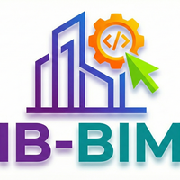

# 🔗 IB-BIM ScheduleLink — User Guide

  

<h1 align="center">IB-BIM ScheduleLink</h1>

Professional Documentation

---

Official user documentation for the **IB-BIM ScheduleLink** add-in for Autodesk® Revit®.  
This repository provides the **public user guide**, screenshots, and related documentation for the app published on the Autodesk App Store.

---

## 📘 About the Add-in

**IB-BIM ScheduleLink** bridges Revit schedules and Excel, allowing users to:
- **Export** any Revit schedule to a professionally formatted Excel file
- **Edit** parameter values directly in Excel with full color-coded guidance
- **Import** changes back to Revit with smart validation and error handling
- **Manage Sheet Numbers** safely with a two-pass algorithm that prevents conflicts

Supports Revit **2023, 2024, 2025, and 2026**.  
Integrates into the Revit Ribbon under the **Add-Ins** tab.

---

## ✨ Key Features

| Feature | Description |
|---------|-------------|
| 📤 **One-Click Export** | Export any schedule to formatted Excel with color-coded columns |
| 📥 **Smart Import** | Edit in Excel, sync back to Revit with full validation |
| 🔢 **Sheet Number Safety** | Two-pass algorithm prevents "already in use" conflicts |
| 🔍 **Duplicate Detection** | Identifies duplicate unique values before applying changes |
| 🛡️ **Error Resilience** | Failed rows don't cancel the entire operation |
| 📊 **Detailed Results** | Clear report of updated, skipped, unchanged, and failed items |
| ↩️ **Undo Support** | Single transaction — Ctrl+Z reverts all changes |
| 🔎 **Schedule Search** | Filter schedules by name for quick access |
| 📋 **Parameter Preview** | See editable vs. read-only parameters before export |

---

## 📚 Documentation

| Document | Description |
|----------|-------------|
| [📖 User Guide](UserGuide.md) | Complete guide — installation, export, import, and troubleshooting |
| [❓ FAQ](FAQ.md) | Frequently asked questions and answers |

---

## 💻 System Requirements

| Requirement | Details |
|-------------|---------|
| **Revit** | 2023, 2024, 2025, or 2026 |
| **OS** | Windows 10 / 11 |
| **Excel** | Microsoft Excel (for editing exported files) |

---

## 📦 Installation

1. Download **ScheduleLink** from the [Autodesk App Store](https://apps.autodesk.com/)
2. Close all Revit instances
3. Run the installer
4. Launch Revit — the **ScheduleLink** button appears in the **Add-Ins** tab

---

## 🚀 Quick Start

1. **Open Revit** → Go to **Add-Ins** tab → Click **ScheduleLink**
2. **Select** a schedule from the list (use search to filter)
3. **Export** → Opens a formatted Excel file
4. **Edit** values in white columns (read-only columns are pink/gray)
5. **Import** → Select the modified Excel file → Review results

> 💡 **Tip:** All changes are in a single transaction — use **Ctrl+Z** to undo everything at once.

---

## 📬 Support

For issues or feature requests, please open an [Issue](https://github.com/itzikb49/IB-BIM-ScheduleLink-Docs/issues).

---

## 📄 License

This software is available on the [Autodesk App Store](https://apps.autodesk.com/).

© 2026 IB-BIM. All rights reserved.
